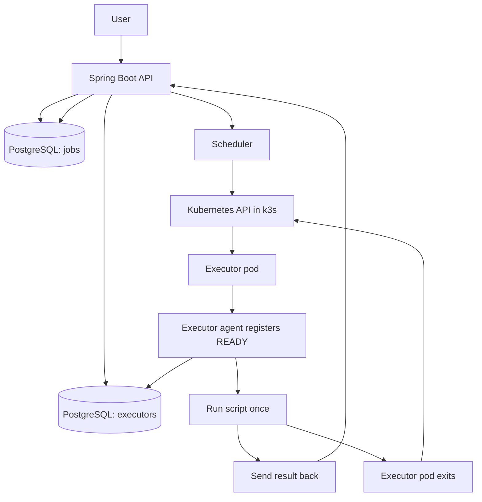

# Executor

This is my small Spring Boot project for running one shell job at a time in k3s.
The idea is to have a control plane that accepts jobs, keeps state in Postgres,
and starts one executor pod for each job.

Important note: my machine is pretty weak, so this project should not reserve too many resources because I still want my other services to keep working.

## Architecture



## What exists

- `POST /jobs` saves a job as `QUEUED`.
- `GET /jobs/{id}` returns the job state and output fields.
- `POST /internal/executors/register` lets an executor register itself as `READY`.
- `POST /internal/executors/{id}/result` saves the result and marks the executor as `TERMINATED`.
- The scheduler starts one executor pod per queued job.

## Example curl commands

Submit a job:

```sh
curl -X POST https://executor.def4alt.com/jobs \
  -H 'Content-Type: application/json' \
  -d '{
    "script": "echo hello world!",
    "requiredResources": {
      "cpus": 1,
      "memory": 128
    }
  }'
```

Get one job by id:

```sh
curl https://executor.def4alt.com/jobs/<job-id>
```

Check service health:

```sh
curl https://executor.def4alt.com/actuator/health
```

## Local development

Run tests:

```sh
nix shell nixpkgs#gradle nixpkgs#jdk -c gradle test
```

Run the app with local Postgres:

```sh
docker compose up --build
```

## Image publishing

GitHub Actions builds and publishes `ghcr.io/def4alt/executor` when I push to `main` or create a version tag.
On pull requests it only runs the tests and does not push an image.

## Layout

- `src/main/kotlin/com/def4alt/executor/api` - controllers and request/response DTOs
- `src/main/kotlin/com/def4alt/executor/application` - main service logic
- `src/main/kotlin/com/def4alt/executor/domain` - core models and enums
- `src/main/kotlin/com/def4alt/executor/persistence` - JDBC repository code
- `src/main/resources/db/migration` - Flyway SQL migrations
- `.github/workflows` - CI and image publishing
