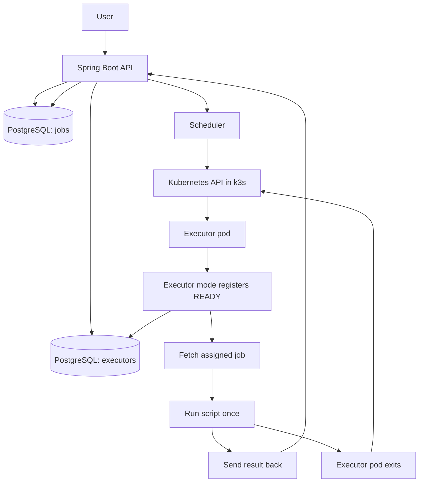

# Executor

This is my small project for running shell jobs on Kubernetes.
The app acts as a control plane that accepts jobs, keeps state in Postgres,
and starts one executor pod for each job.

Important note: my machine is pretty weak, so this project should not reserve too many resources because I still want my other services to keep working :)

## Architecture



## What exists

- `POST /jobs` saves a job as `QUEUED`.
- `GET /jobs/{id}` returns the job state, requested resources, timestamps, and output fields.
- The scheduler atomically claims one queued job, creates one executor pod, and assigns that executor id to the job.
- The pod runs the same application image in `executor` mode, registers with the control plane, fetches its assignment, runs the script once, reports the result, and exits.
- Internal executor endpoints require `X-Executor-Token`.
- Job results are `FINISHED` when `exitCode == 0` and `FAILED` otherwise.

## Example curl commands

Submit a job:

```sh
curl -X POST https://executor.def4alt.com/jobs \
  -H 'Content-Type: application/json' \
  -d '{
    "script": "echo hello world!",
    "requiredResources": {
      "cpus": 1,
      "memory": 1024
    }
  }'
```

Get one job by id:

```sh
curl https://executor.def4alt.com/jobs/<job-id>
```

Check service health:

```sh
curl https://executor.def4alt.com/actuator/health
```

## Local development

Run tests:

```sh
gradle test
```

Run the app with local Postgres:

```sh
docker compose up --build
```

That local compose setup is API-only: it disables the scheduler and Kubernetes launcher so the service can start without a cluster.
Real remote execution requires Kubernetes plus a valid executor image and internal executor token.

## Layout

- `src/main/kotlin/com/def4alt/executor/api` - controllers and request/response DTOs
- `src/main/kotlin/com/def4alt/executor/application` - main service logic
- `src/main/kotlin/com/def4alt/executor/domain` - core models and enums
- `src/main/kotlin/com/def4alt/executor/persistence` - JDBC repository code
- `src/main/resources/db/migration` - Flyway SQL migrations
- `.github/workflows` - CI and image publishing
