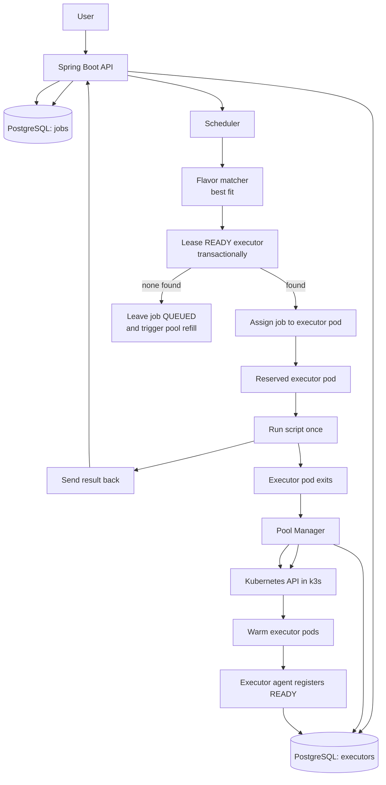

# Executor

This is my small Spring Boot project for running one shell job at a time in k3s.
The idea is to have a control plane that accepts jobs, keeps state in Postgres,
and sends each job to one executor pod.

I kept the default executor sizes pretty small because my homelab is not very strong:

- `small-linux`: 1 vCPU, 512 MiB
- `medium-linux`: 1 vCPU, 1024 MiB
- `large-linux`: 2 vCPU, 2048 MiB

Important note: my machine is pretty weak, so this project should not reserve too many resources or create too many warm pods by default because I still want my other services to keep working.

## Architecture



## What exists

- `POST /jobs` saves a job as `QUEUED` and picks the smallest flavor that can run it.
- `GET /jobs/{id}` returns the job state and output fields.
- `POST /internal/executors/register` lets an executor register itself as `READY`.
- `POST /internal/executors/{id}/result` saves the result and marks the executor as `TERMINATED`.
- There is also basic scheduler and pool logic in the code already, but it is still an early version.

## Local development

Run tests:

```sh
nix shell nixpkgs#gradle nixpkgs#jdk -c gradle test
```

Run the app with local Postgres:

```sh
docker compose up --build
```

## Image publishing

GitHub Actions builds and publishes `ghcr.io/def4alt/executor` when I push to `main` or create a version tag.
On pull requests it only runs the tests and does not push an image.

## Layout

- `src/main/kotlin/com/def4alt/executor/api` - controllers and request/response DTOs
- `src/main/kotlin/com/def4alt/executor/application` - main service logic
- `src/main/kotlin/com/def4alt/executor/domain` - core models and enums
- `src/main/kotlin/com/def4alt/executor/persistence` - JDBC repository code
- `src/main/kotlin/com/def4alt/executor/pool` - warm-pool calculation code
- `src/main/resources/db/migration` - Flyway SQL migrations
- `.github/workflows` - CI and image publishing
